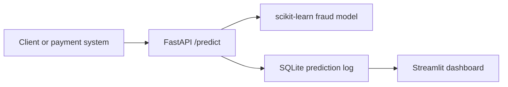

# Fraud Detection API

Real-time fraud detection system that scores payment transactions with a scikit-learn model and serves predictions through a FastAPI backend.

## Features

- Transaction dataset for a baseline fraud model
- scikit-learn training pipeline saved with joblib
- FastAPI prediction endpoint at `POST /predict`
- SQLite logging for prediction history
- Streamlit dashboard for monitoring risk
- Docker setup
- pytest API tests

## Project Structure

```text
fraud-detection-api/
├── app/
│   ├── main.py
│   ├── model.py
│   ├── schemas.py
│   └── database.py
├── dashboard/
│   └── streamlit_app.py
├── data/
│   └── transactions.csv
├── notebooks/
│   └── model_training.ipynb
├── models/
│   └── fraud_model.pkl
├── scripts/
│   └── train_model.py
├── tests/
│   └── test_api.py
├── requirements.txt
├── Dockerfile
└── README.md
```

## Quick Start

```bash
python -m venv venv
source venv/bin/activate
pip install -r requirements.txt
python scripts/train_model.py
uvicorn app.main:app --reload
```

Open the API docs at [http://127.0.0.1:8000/docs](http://127.0.0.1:8000/docs).

## Example Prediction

```bash
curl -X POST "http://127.0.0.1:8000/predict" \
  -H "Content-Type: application/json" \
  -d '{
    "transaction_id": "txn_demo_001",
    "amount": 950.0,
    "transaction_hour": 2,
    "merchant_category": "electronics",
    "customer_age_days": 10,
    "is_foreign_transaction": true,
    "is_new_merchant": true,
    "previous_chargebacks": 1
  }'
```

Example response:

```json
{
  "transaction_id": "txn_demo_001",
  "fraud_score": 0.91,
  "risk_level": "high",
  "reasons": [
    "unusual amount",
    "unusual transaction time",
    "new merchant",
    "foreign location",
    "previous chargebacks",
    "new customer account"
  ]
}
```

## Dashboard

Run the API first, send a few predictions, then launch:

```bash
streamlit run dashboard/streamlit_app.py
```

## Tests

```bash
pytest
```

## Docker

```bash
docker build -t fraud-detection-api .
docker run -p 8000:8000 fraud-detection-api
```

## Architecture



## CV Bullet

Built a fraud detection API using FastAPI and scikit-learn to classify payment transactions in real time, with model inference, prediction logging, and a dashboard for risk monitoring.

